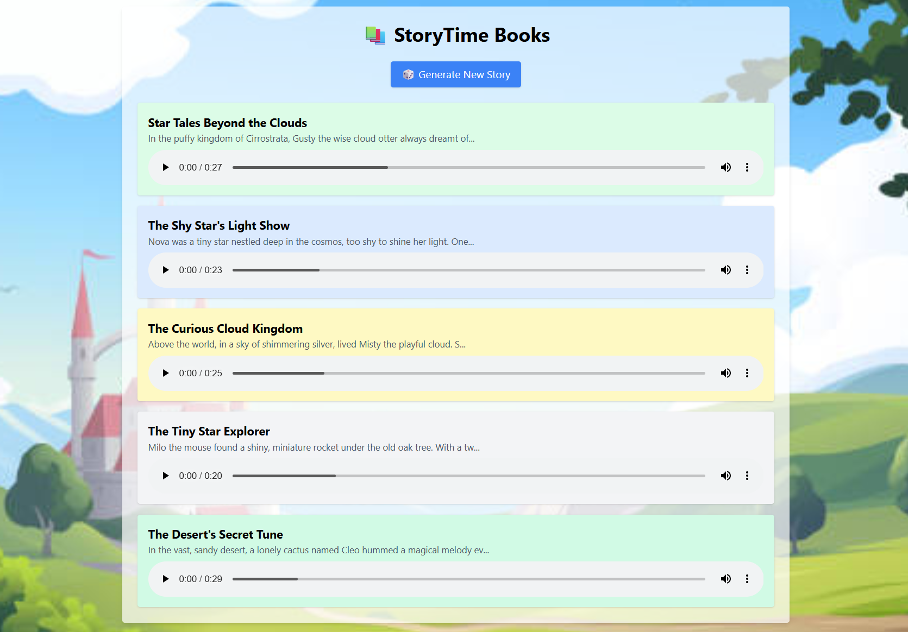

<div align="center">
  
  <h1>🧠 StoryTime – AI-Powered Children’s Book Generator</h1>
  <p><a href="https://www.storybooks.site" target="_blank"><strong>🌐 Visit the Live App</strong></a></p>
</div>

---

## 🎬 Live Demo

Explore the full experience on the website:

👉 [🌐 www.storybooks.site](https://www.storybooks.site)

- ✅ Voice-narrated children’s stories
- ✅ AI-generated short tales in 4 sentences
- ✅ Audio file playback (via ElevenLabs)
- ✅ Hosted & deployed frontend/backend 

---

## 📦 Project Overview

This project is a full-stack AI storytelling app that allows users to generate magical 4-sentence stories, complete with audio narration and themes like forest, underwater, space, and more.  

Stories are stored in PostgreSQL, generated via OpenAI (GPT-4 Turbo), and converted to mp3 audio using ElevenLabs, then uploaded to AWS S3.

---

## 🖼️ Frontend Repository

👉 [GitHub – storytime-frontend](https://github.com/vanthienha199/storytime-frontend)

Built with:
- React (Vite)
- Tailwind CSS
- REST API integration
- Audio player UI
- Clean animations & UX

---

## 🔧 Backend Repository

👉 [GitHub – storytime-backend](https://github.com/vanthienha199/storytime-backend)

### Features:
- 🧠 GPT-4 Turbo – 4-sentence story generation with rotating themes
- 🎤 ElevenLabs API – text-to-speech with audio buffer
- ☁️ AWS S3 – upload and serve mp3 files
- 🗃️ PostgreSQL – story storage
- 🎯 RESTful API – Create / Read / Update / Delete books
- 🔁 Auto-delete – Keep only latest 5 stories per user

### Endpoints:
| Method | Endpoint | Description |
|--------|----------|-------------|
| GET    | `/books` | Get 5 latest books |
| GET    | `/books/:id` | Get single book |
| POST   | `/books` | Create manual book |
| PUT    | `/books/:id` | Update book |
| DELETE | `/books/:id` | Delete book |
| POST   | `/books/:id/generate-story` | Generate full story with GPT |
| POST   | `/books/generate-quick-story` | Generate 4-sentence story + audio |

---

## 🌐 Tech Stack

### Frontend
- React (Vite)
- Tailwind CSS
- Axios
- React Audio Player

### Backend
- Express.js
- OpenAI GPT-4 Turbo
- ElevenLabs API
- AWS SDK (S3Client)
- PostgreSQL (with pg)
- dotenv, nodemon

---

## 🗃️ Database Structure

PostgreSQL table `books` includes:
- `id` (PK)
- `title`
- `content`
- `theme`
- `audio_url`
- `created_at`

---

## 🚀 Deployment

- Frontend deployed via Vercel: `https://www.storybooks.site`
- Backend deployed via Render (Web Service)
- S3 Bucket stores public mp3 audio links
- PostgreSQL hosted on Render

---

## 🧠 AI Prompt Design

Custom prompt with rotating themes:
```text
Write a children's story in exactly 4 short, imaginative sentences.
Each new story must follow a rotating theme: forest, underwater, desert, space, etc.
Generate unique title, unique characters, unique plot every time.
Return as: { "title": "...", "story": "...", "theme": "..." }
